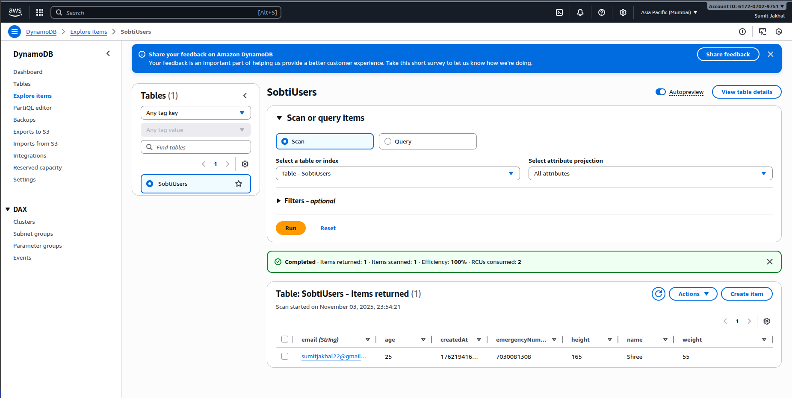

# ⚡ AWS Cognito Identity Pool Setup & DynamoDB Integration Guide

This guide explains how to configure **AWS Cognito Identity Pool** for **guest (unauthenticated)** access and connect it with **Amazon DynamoDB** for use in your Android or Java project.

---

## 🎥 Setup Video
Watch the complete setup process in this screen recording:

▶️ [Download Screenrecording.mp4](./screenshots/Screenrecording.mp4)


---

## 🖼 DynamoDB Screenshot
Below is an image of the DynamoDB table used in this setup:




---

## 🧩 Step 3: Configure Identity Pool Trust

### 🔹 Section 1: Identity Pool Name
- Identity pool name: `SobtiIdentityPool`  
  ✅ Type exactly: **SobtiIdentityPool** (no spaces)

---

### 🔹 Section 2: Identity Sources
You'll see options such as:

- Authenticated access  
- Guest access  

✅ **Enable Guest Access**  
Check this box: and Next

---

### 🔹 Create a New IAM Role
Create a new IAM role  
● Create a new role  ← KEEP THIS SELECTED  
○ Use an existing role  

**Role name:** `Cognito_SobtiIdentityPoolAuth_Role`

**Permissions Policies:**  
Just Keep as it is , don't needs changes in there  
click **Next** Button.

---

### 🔹 Copy Your Identity Pool ID
After creation, you'll see:

✓ Successfully created identity pool: **SobtiIdentityPool**

Identity pool ID: us-east-1:12345678-abcd-1234-5678-123456789abc
↑↑↑↑↑↑↑↑↑↑↑↑↑↑↑↑↑↑↑↑↑↑↑↑↑↑↑↑↑↑↑↑↑↑↑↑↑↑↑↑↑↑↑↑↑↑↑↑↑↑↑
COPY THIS ENTIRE STRING!


---

## 🔐 Configure IAM Permissions for DynamoDB

Now we need to give the unauthenticated role access to DynamoDB.

Navigate to IAM Console:

- Open new tab: [https://console.aws.amazon.com/iam/](https://console.aws.amazon.com/iam/)
- Click **"Roles"** in left sidebar  
- In search box, type: `Cognito_SobtiIdentityPoolUnauth`  
- Click on **"Cognito_SobtiIdentityPoolUnauth_Role"**

---

### 🔹 Attach DynamoDB Policy
You'll see the role details page:

**Permissions policies (0)**  
[Add permissions ▼]

Click **"Add permissions"** dropdown  
Select **"Attach policies"**

In search box, type: `DynamoDB`  
Find and check: ☑ **AmazonDynamoDBFullAccess**  
Click **"Attach policies"** button at bottom

---

## 📱 Update Your Android App

**File location:**  
`mobile/src/main/java/com/example/sobti/aws/AWSConfig.java`

**10.2: Replace the Identity Pool ID**

Find this line (around line 10):

```java
private static final String COGNITO_POOL_ID = "us-east-1:YOUR-COGNITO-IDENTITY-POOL-ID";


